```mermaid
flowchart TD
  A[App.jsx loads] --> B{useEffect runs once}
  B --> C[Send request to /api/auth/refresh-token]
  C --> D[Include credentials &#40;cookies&#41;]
  D --> E{Backend verifies refresh token}

  E -- valid --> F[Backend responds with new accessToken + user]
  F --> G[Dispatch setCredentials with new data]
  G --> H[Redux auth state is hydrated]
  H --> I[App renders with user logged in]

  E -- invalid or expired --> J[Error caught in catch block]
  J --> K[Optional: redirect to login]
  J --> I

  style H fill:#b5f5ec,stroke:#0f766e,stroke-width:2px
  style G fill:#a7f3d0,stroke:#047857,stroke-width:2px
  style K fill:#fecaca,stroke:#991b1b,stroke-width:2px

```

## 🔖 Summary (Stamped in Brain-Friendly English)

- When the app starts, you hit the refresh route to check for a session
- If a valid refresh token exists:

  - You get a new access token and user info
  - Redux is updated (user is logged in again)

- If the refresh fails:

  - You can log them out or show guest UI

- All of this runs **before the app fully renders**, preventing a "flash" of logged-out UI
