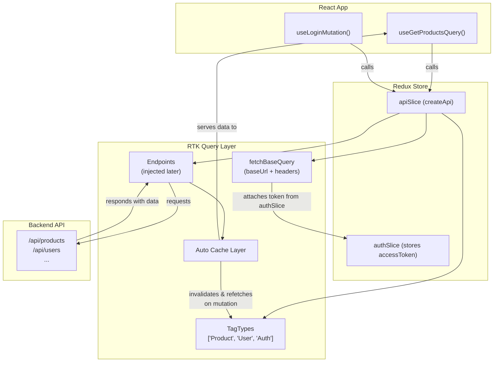

### ✅ Mermaid Code (for Flowchart View)



### 🧠 Explanation of Each Section:

#### 🧩 `apiSlice` (`createApi`)

- This is the **core configuration object**.
- It’s where you define:

  - `baseQuery` — how to make HTTP requests
  - `tagTypes` — the cache labels for automatic updates
  - `endpoints` — which you’ll inject later (like `getProducts`, `loginUser`)

#### 🧵 `fetchBaseQuery`

- A preconfigured wrapper around `fetch()`
- Automatically handles:

  - Attaching the `baseUrl`
  - Injecting auth headers (`Bearer token`) using the `prepareHeaders` function
  - Including credentials (for sessions/cookies)

#### 🧠 `authSlice`

- Stores authentication state (`accessToken`)
- `prepareHeaders` taps into this slice via `getState()` to add the token to outgoing requests

#### 🛠 `endpointHandlers`

- Where you define actual API calls using `builder.query()` or `builder.mutation()`
- Generates hooks like:

  - `useGetProductsQuery()`
  - `useLoginMutation()`

- Hooks connect your components directly to the backend logic — no wiring required

#### 🧺 `cache`

- Stores data fetched from API so components don’t have to refetch unnecessarily
- Data is tagged using `tagTypes` like `"Product"` or `"User"`
- When you run a mutation (e.g., `addProduct`), you can say:

  ```js
  invalidatesTags: ["Product"];
  ```

  and RTK Query will automatically refetch any stale `"Product"` queries

#### 💬 React Components

- Use auto-generated hooks (e.g., `useGetProductsQuery`) to:

  - Trigger requests
  - Get `data`, `isLoading`, `error`, etc.
  - Re-render automatically when data changes

#### 🌍 Backend Server

- Your RESTful API endpoints (e.g., `/api/products`, `/api/users`)
- Receives requests via `fetchBaseQuery`, responds with data that gets cached and fed into the components

## 🧠 The Big Picture

- `apiSlice` is the _brain_ of your data flow.
- `fetchBaseQuery` is the _mouth_, talking to the backend.
- RTK Query is the _nervous system_, syncing your state with the server automatically.
- And your components? They're the _eyes and ears_, always up to date — no manual `useEffect`, no messy `axios`, no Redux actions/reducers unless you need fine-grained control.
