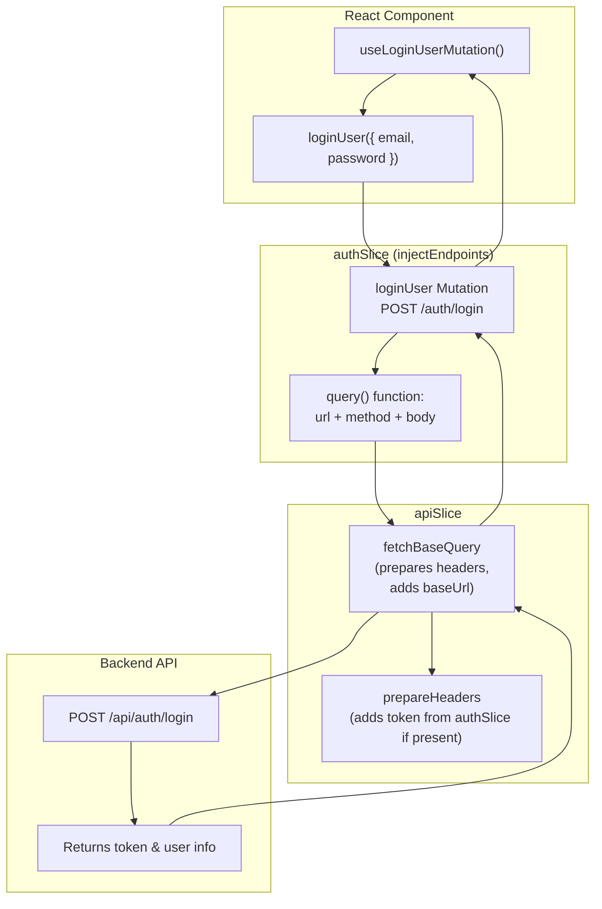

### ✅ **Mermaid Flowchart for `authSlice`**



### 🧠 Breakdown of Each Piece

#### 🎣 `useLoginUserMutation()` (React Hook)

- This is the **auto-generated hook** from RTK Query based on your mutation name (`loginUser`)
- Gives you a function to trigger the mutation (`loginUser()`) and state like `isLoading`, `error`, `data`

#### 🧨 `loginUser Mutation`

- Defined inside `injectEndpoints` in `authSlice`
- Tells RTK Query how to **structure the request** to log in:

  - `POST`
  - URL: `${AUTH_URL}/login`
  - Payload: `{ email, password }`

#### 🛠 `fetchBaseQuery`

- Automatically called by RTK Query to handle the request
- It:

  1. Adds the `baseUrl`
  2. Adds authorization headers (via `prepareHeaders`)
  3. Sends the request using `fetch()`

#### 🔐 `prepareHeaders`

- Pulls the `accessToken` from Redux state (`authSlice`)
- Adds it to the headers if it exists:

  ```
  headers.set("authorization", `Bearer ${token}`)
  ```

#### 🧰 Server-Side: `/api/auth/login`

- The backend endpoint receives the POST request with credentials
- If successful, responds with:

  - A JWT or session token
  - User info (e.g., name, email)

#### 💾 Response Handling

- RTK Query stores the result in the cache
- Your component re-renders with the updated state

### 🎯 Why This Architecture Rocks

- **Scalable** — Easily add more endpoints (e.g., register, logout)
- **Auto-generated hooks** — No manual thunk dispatching
- **Built-in state management** — Handles `loading`, `error`, `data` without extra reducers
- **Token injection** — Handles auth transparently
- **Real-time updates** — Add `providesTags` and `invalidatesTags` for cache syncing
