### ✅ Mermaid Auth Flow (Access + Refresh Tokens)

```mermaid
sequenceDiagram
  participant U as 🧍User
  participant FE as 💻 Frontend (React App)
  participant BE as 🔐 Backend (Node/Express API)
  participant DB as 🗄️ Database

  %% LOGIN FLOW
  U->>FE: Submit login (email + password)
  FE->>BE: POST /auth/login
  BE->>DB: Validate credentials
  DB-->>BE: User found + verified
  BE-->>FE: Response with:<br/>Set-Cookie: refreshToken (HttpOnly)<br/>{ accessToken, user }

  FE->>FE: Store accessToken + user in Redux

  %% REQUEST FLOW
  U->>FE: Navigate to protected route
  FE->>BE: GET /api/protected
  Note right of FE: Authorization: Bearer accessToken
  BE->>BE: Validate accessToken
  BE-->>FE: Protected data

  %% EXPIRED ACCESS TOKEN
  Note over FE,BE: After 15 minutes...
  FE->>BE: GET /auth/refresh-token
  Note right of FE: Cookie automatically sent (refreshToken)
  BE->>BE: Verify refreshToken
  BE-->>FE: { accessToken, user }

  FE->>FE: Dispatch(setCredentials(...))

  %% LOGOUT
  U->>FE: Click Logout
  FE->>BE: POST /auth/logout
  BE->>BE: Clear refreshToken cookie
  BE-->>FE: { message: "Logged out" }
  FE->>FE: Clear Redux state
```

---

### 🧠 Key Flow Highlights

| Stage | What Happens |
| --- | --- |
| **Login** | User submits form → backend returns accessToken + refreshToken in cookie |
| **Redux Set** | `accessToken` and `user` stored in Redux via `setCredentials()` |
| **Auth Requests** | Access token used in headers for protected routes |
| **Access Expired** | Frontend silently calls `/refresh-token` using secure cookie |
| **Refresh Success** | Backend returns new access token → Redux state updates again |
| **Logout** | Refresh token is cleared → session is fully revoked |

---

Let me know if you want this visual **rendered as an image** or exported to a PNG — or if you'd like a flowchart version instead of sequence style. You're walking the walk now, Rob. 💪🧙‍♂️
