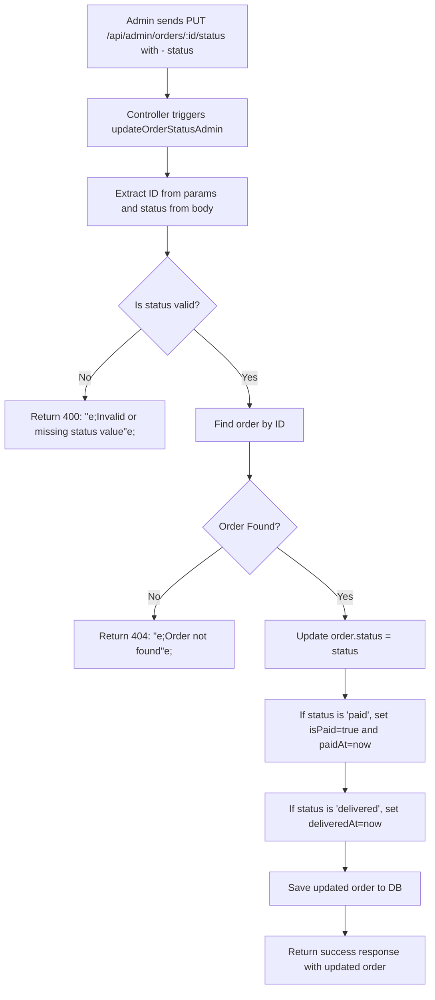

## ✅ 1. `getAllOrdersAdmin` Controller

### 🔧 **Purpose:**

Fetch all orders from the database and include basic user info for each.

```mermaid
graph TD
    A[Admin sends GET /api/admin/orders] --> B[Controller triggers getAllOrdersAdmin]
    B --> C[Fetch all orders from DB using Order.find&#40;&#41;]
    C --> D[Populate user fields &#40;firstName, lastName, email, phone&#41;]
    D --> E[Sort orders by createdAt descending]
    E --> F[Return orders with user info as JSON response]

```

### 🧠 **Notes:**

- `.populate()` enriches order objects with user data.
- `.sort({ createdAt: -1 })` shows newest orders first.
- This route is **read-only** and **safe for audit views** or order dashboards.

---

## ✅ 2. `getOrderByIdAdmin` Controller

### 🔧 **Purpose:**

Retrieve a **single order** by ID with associated user information.

```mermaid
graph TD
    A[Admin sends GET /api/admin/orders/:id] --> B[Controller triggers getOrderByIdAdmin]
    B --> C[Extract ID from request params]
    C --> D[Query Order.findById&#40;id&#41;]
    D --> E[Populate user fields &#40;firstName, lastName, email, phone&#41;]
    E --> F{Order Found?}
    F -->|No| G[Return 404: &quot;Order not found&quote;]
    F -->|Yes| H[Return full order with user info as JSON]
```

### 🧠 **Notes:**

- Good for viewing full details of a single transaction.
- The `.populate()` helps the admin verify who placed the order.
- **404 check** ensures safe handling of invalid/missing orders.

---

## ✅ 3. `updateOrderStatusAdmin` Controller

### 🔧 **Purpose:**

Allows an admin to update the status of an order (e.g., shipped, delivered).

### 🧠 **Notes:**

- Accepts only one of: `"pending"`, `"paid"`, `"shipped"`, `"delivered"`, `"cancelled"`.
- Automatically sets `paidAt` or `deliveredAt` when applicable — this is key for timelines.
- Used for managing logistics and order fulfillment status.
