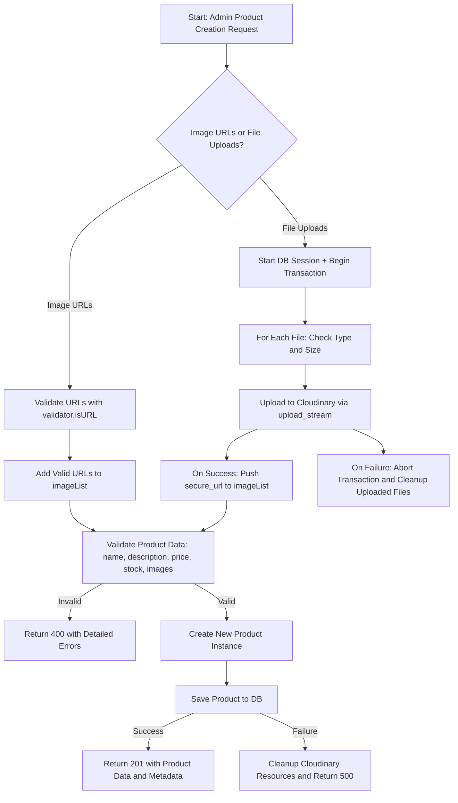
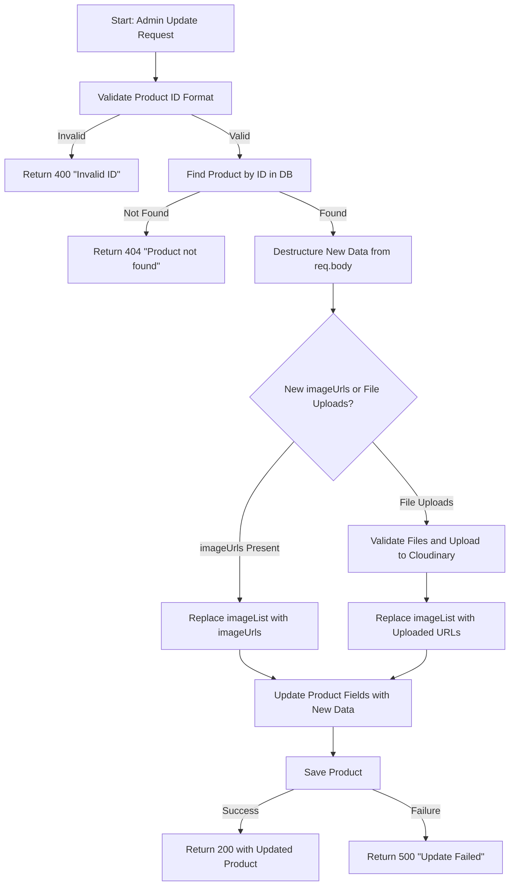
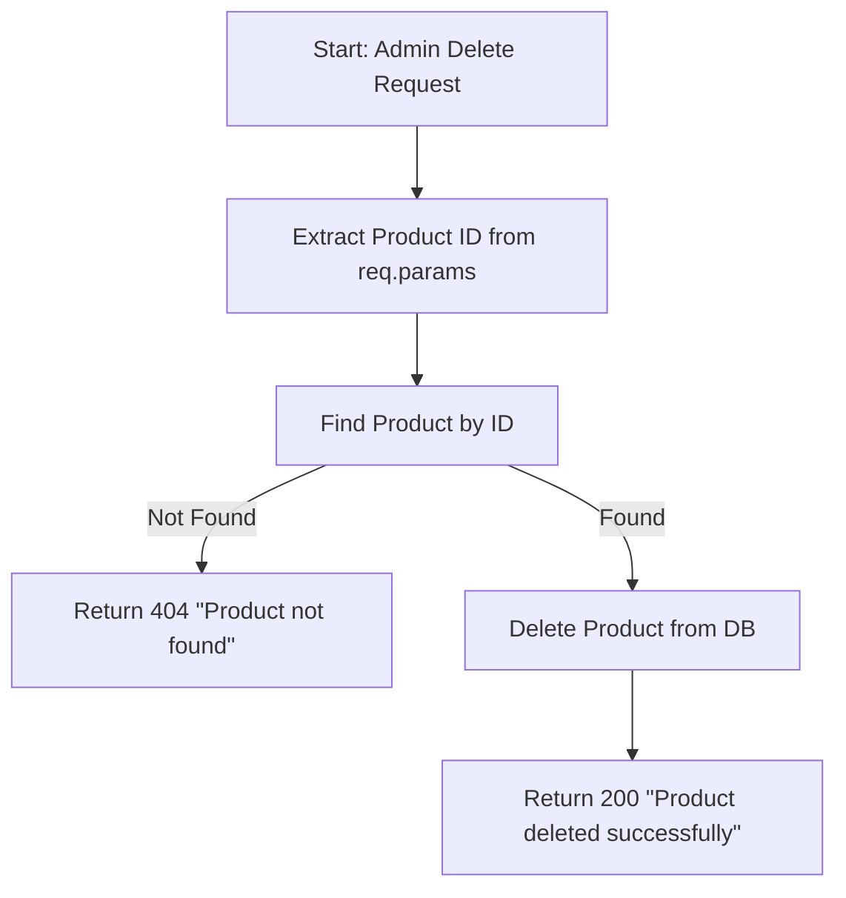

### ✅ `createProduct` Controller

**📝 Notes:**

- Handles both image URLs and file uploads via Cloudinary.
- Includes comprehensive validation and error reporting.
- Uses DB transaction to ensure upload consistency.

---

### ✏️ `updateProductByIdAdmin` Controller

**📝 Notes:**

- Supports optional replacement of images.
- Fallbacks to original values if no new ones provided.
- Errors during upload handled cleanly.

---

### ❌ `deleteProductByIdAdmin` Controller

**📝 Notes:**

- Simple and safe delete process.
- Returns appropriate messages for success and not-found cases.
- Assumes deleteOne triggers pre-hooks if any.

---

Would you like me to export these as `.png` diagrams as well?
