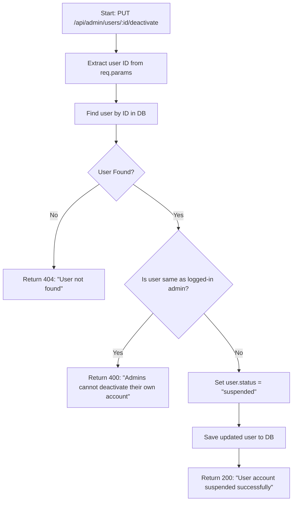
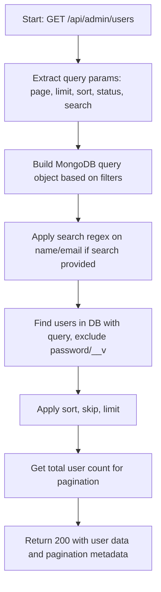
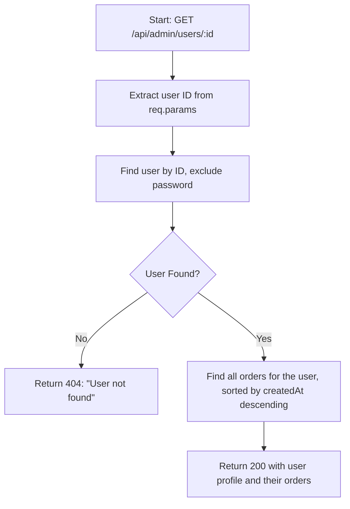

## 📊 Admin User Controller Flowcharts

This section describes the flow of each admin controller using Mermaid flowcharts. These are helpful for understanding backend logic visually.

### 🔒 1. Deactivate User by ID

**Route:** `PUT /api/admin/users/:id/deactivate` **Description:** Suspends a user account (admin-only access)

**Notes:**

- Prevents self-deactivation by checking `req.user._id`.
- Sets the `status` field to `&quot;suspended&quot;`.
- Provides clear error messages for each failure path.

---

### 📄 2. Get All Users (with Filters, Pagination, and Search)

**Route:** `GET /api/admin/users` **Description:** Retrieves all users with support for search, sort, pagination, and filtering.

**Notes:**

- Supports query parameters: `page`, `limit`, `sort`, `status`, `search`.
- Filters and searches users by name or email (case-insensitive).
- Returns clean user data and pagination info for frontend rendering.

---

### 👤 3. Get Single User with Orders

**Route:** `GET /api/admin/users/:id` **Description:** Fetches a user’s profile and their order history.

**Notes:**

- Helps admins view individual user data and order history.
- Sensitive data like password is excluded.
- Orders are sorted by most recent first for better UX.
