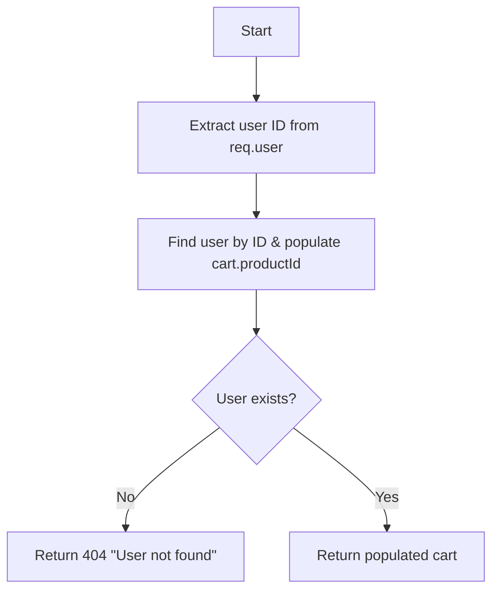
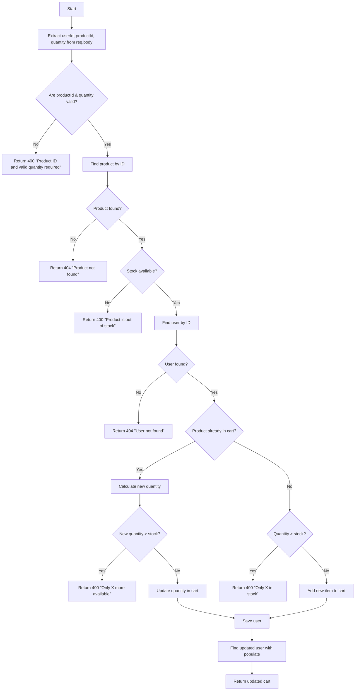
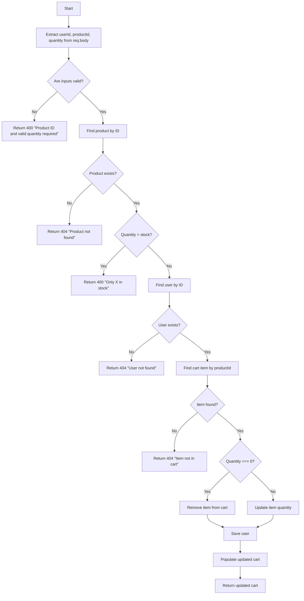
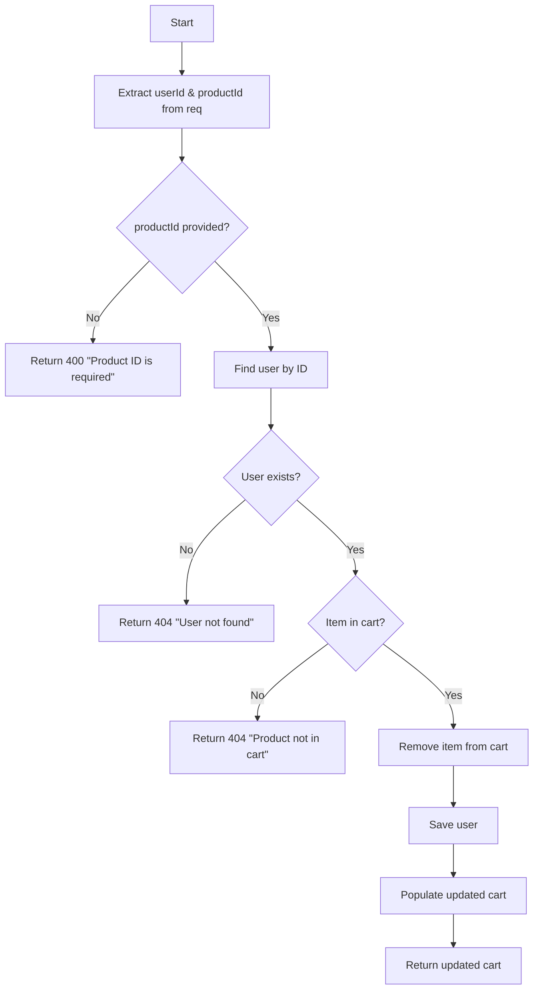

### 🛒 **1. `getUserCart` Controller**

> **Notes**:
>
> - This controller assumes `req.user` is populated by auth middleware.
> - It uses `.populate(&quot;cart.productId&quot;)` to retrieve product details in the cart.
> - If the user is not found (deleted but token still valid), returns a 404.

### ➕ **2. `addToCart` Controller**

> **Notes**:
>
> - Handles both insert and update in a single route.
> - Strict quantity and stock validation.
> - Returns populated cart after updating.

### ✏️ **3. `updateCartItem` Controller**

> **Notes**:
>
> - Allows setting quantity to 0 to remove the item.
> - Validates stock and ensures cart integrity.
> - Returns the fully populated cart.

### ❌ **4. `removeFromCart` Controller**

> **Notes**:
>
> - Ensures item is in cart before removing.
> - Removes item using `.filter(...)`.
> - Final response includes populated product data.
