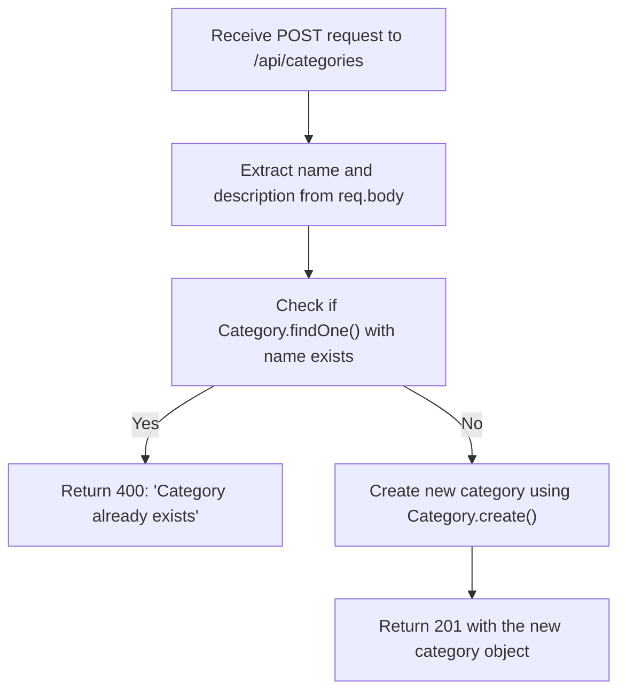
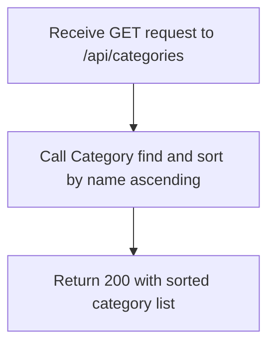
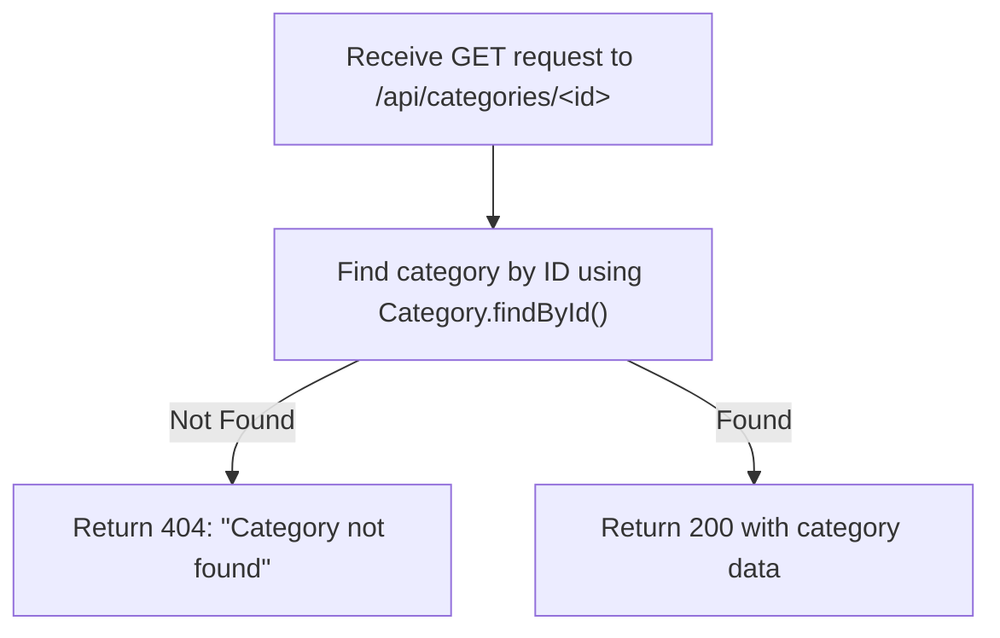
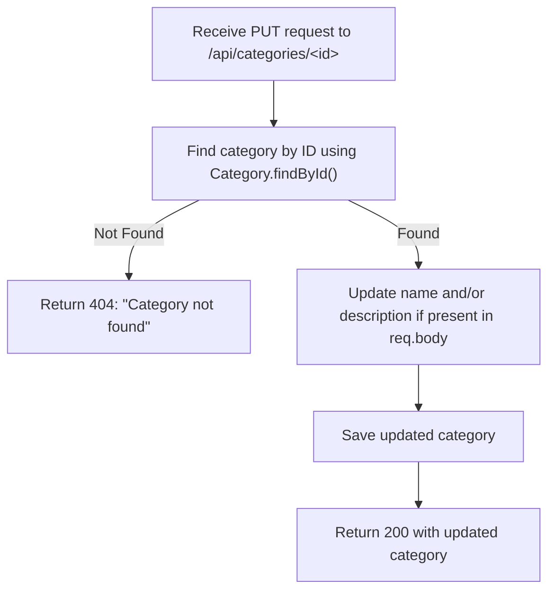
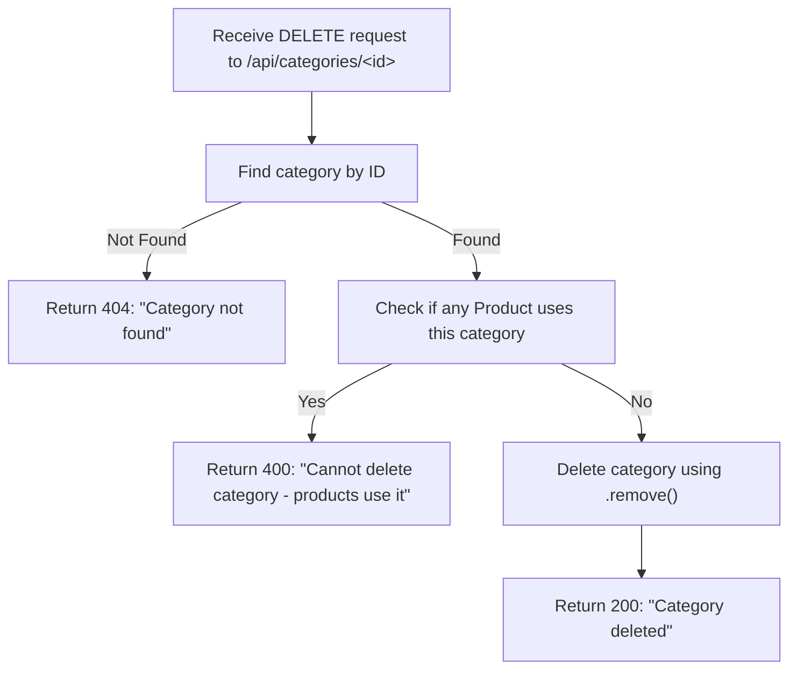

## 🧭 Category Controllers - Mermaid Flowcharts

### 1. `createCategory` Controller

**Notes:**

- Ensures category name uniqueness.
- Responds with a 400 if name already exists.
- Returns the newly created category with 201 status on success.

### 2. `getAllCategories` Controller

**Notes:**

- Retrieves and alphabetically sorts all categories.
- Public endpoint with minimal logic.

### 3. `getCategoryById` Controller

**Notes:**

- Simple ID-based lookup.
- Returns 404 if not found.

### 4. `updateCategory` Controller

**Notes:**

- Checks if the category exists.
- Updates name and/or description conditionally.
- Saves and returns the updated document.

### 5. `deleteCategory` Controller

**Notes:**

- Protects integrity by preventing deletion if products are assigned to the category.
- If no products use it, proceeds with deletion.
