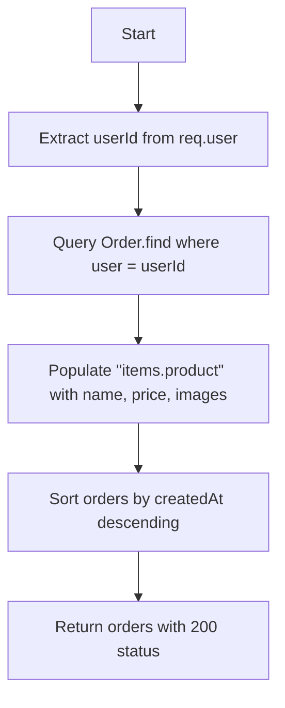
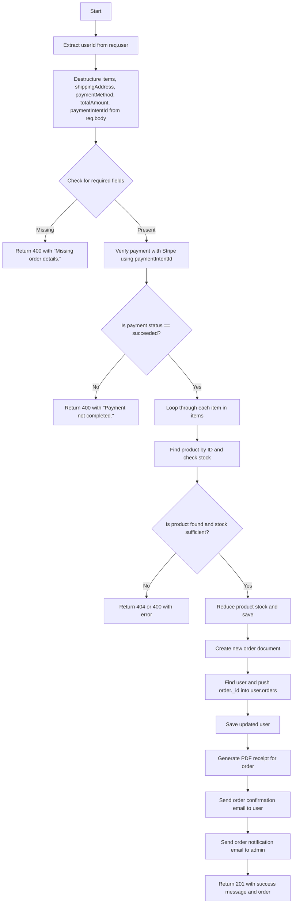

## 📦 `getUserOrders` Controller

### 🔍 Description

This controller handles fetching the order history for the currently logged-in user.

### 🧠 Notes

- Uses `req.user._id` to determine which user is making the request.
- Utilizes Mongoose's `.populate()` to include specific product details inside each order's items.
- Orders are sorted by creation date so the most recent appears first.
- Response is sent back as a JSON array of orders with `200 OK`.

## 🛒 `createOrder` Controller

### 🧠 Notes

- This controller is called **after** the Stripe payment is completed.
- Validates incoming data before processing.
- Retrieves and verifies the Stripe PaymentIntent to ensure payment went through.
- Each item is checked for inventory availability and stock is reduced accordingly.
- Creates an `Order` entry and links it to the user.
- Generates a PDF receipt and emails it to both the customer and the admin.
- Uses `path`, `nodemailer`, and a utility function (`generateReceipt`) for receipt creation and email delivery.
