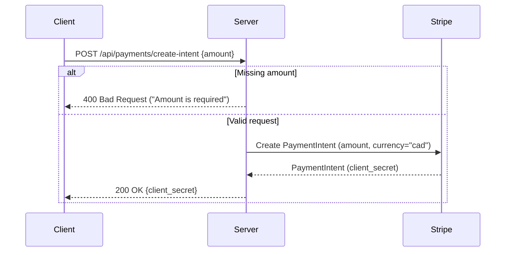
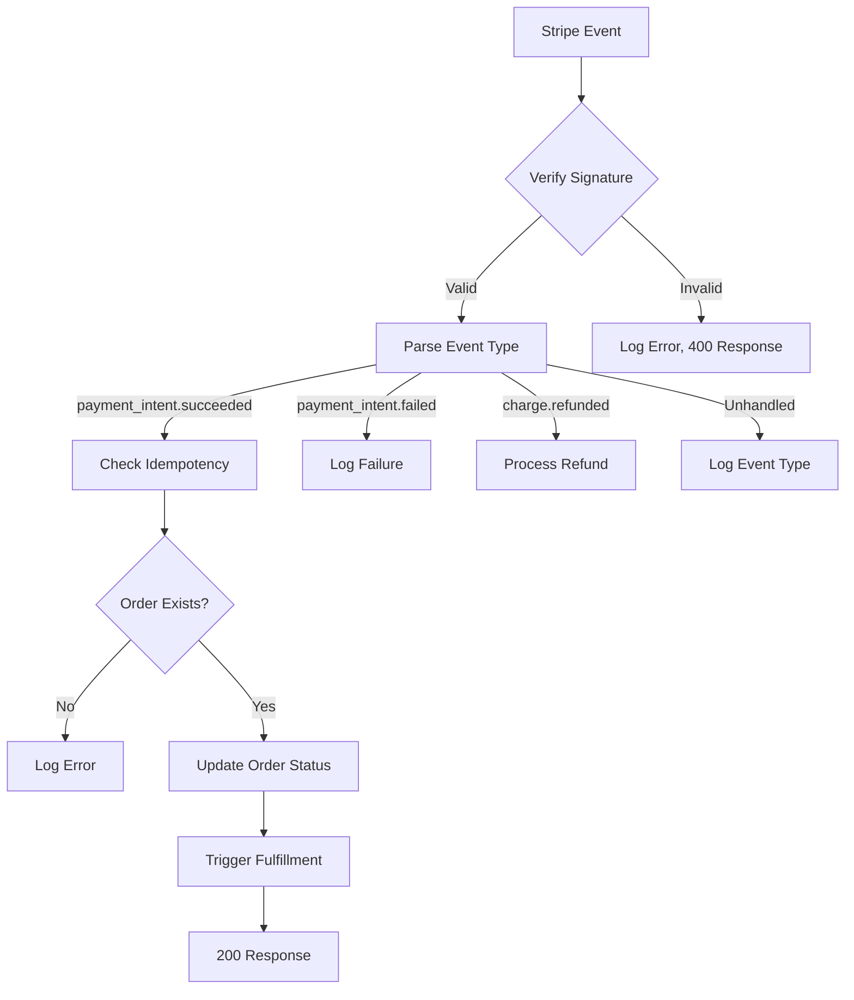
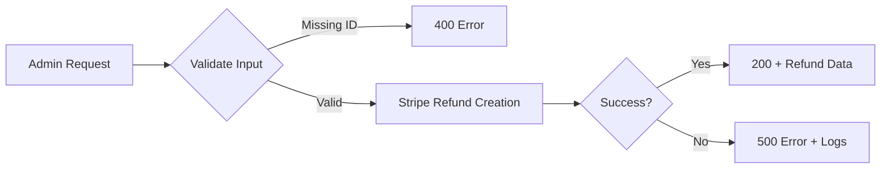

### **1. createPaymentIntent Workflow**

**Key Notes:**

- **Purpose:** Creates a PaymentIntent for client-side payment processing
- **Security:**
  - Requires authentication (private route)
  - Uses Stripe secret key from env vars
- **Currency Handling:**
  - Amount is in cents (e.g., $19.99 = 1999)
  - Hardcoded to CAD (adjustable for multi-currency)
- **Client-Side Use:**
  - Frontend uses `client_secret` with Stripe.js to complete payment
- **Error Handling:**
  - Basic validation for missing amount

---

### **2. stripeWebhook Workflow**

**Key Notes:**

- **Security Critical:**
  - Uses `STRIPE_WEBHOOK_SECRET` to verify events
  - Processes raw body (requires `express.raw()` middleware)
- **Idempotency:**
  - Checks for existing processed orders to prevent duplicates
- **Event Handling:**
  - **Success:** Updates order status, converts cents to dollars
  - **Failure:** Logs error (extend to notify users)
  - **Refunds:** Placeholder for refund logic
- **Production Considerations:**
  - Add retry queues for failed DB updates
  - Admin alerts for critical failures
- **Response:** Must return 200 within 3 seconds to prevent Stripe retries

---

### **3. refundPayment Workflow**

**Key Notes:**

- **Access Control:** Admin-only route (implement middleware)
- **Refund Scope:**
  - Full refund by default (extend for partial refunds)
  - Refunds to original payment method
- **Async Nature:**
  - Refund processing may take time (webhook should handle completion)
- **Next Steps:**
  - Link to order system (e.g., update inventory)
  - Notify user via email
- **Error Handling:**
  - Logs detailed Stripe errors
  - Distinguishes between invalid IDs and processing failures

---

### **Common Themes Across All Workflows**

1. **Stripe Integration:**

   - All controllers use the Stripe client initialized with `STRIPE_SECRET_KEY`
   - Consistent currency/amount handling (cents → dollars)

2. **Error Handling:**

   - Logs errors with context
   - Returns appropriate HTTP status codes

3. **Production Enhancements:**

   - Add logging (e.g., Winston)
   - Implement retry mechanisms for transient failures
   - Add monitoring (e.g., Sentry for errors)

4. **Security:**
   - Webhook must verify signatures
   - Payment routes should use HTTPS
   - Consider rate limiting for public endpoints
