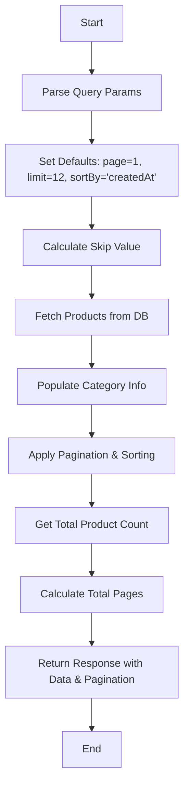
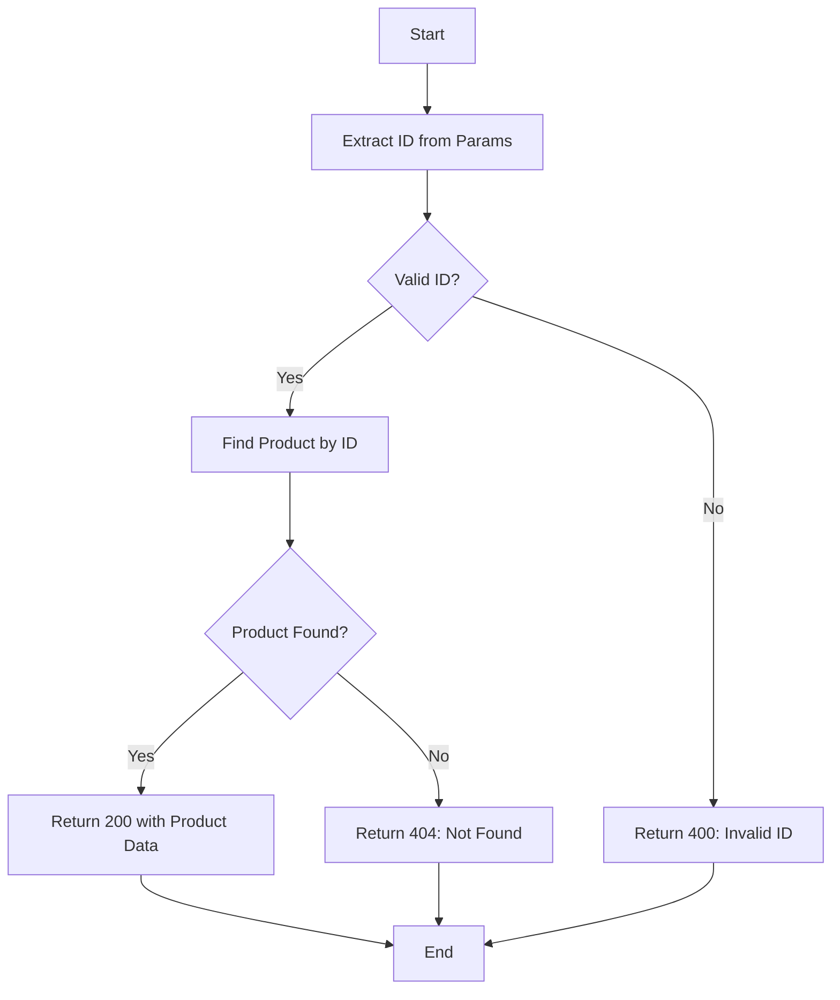
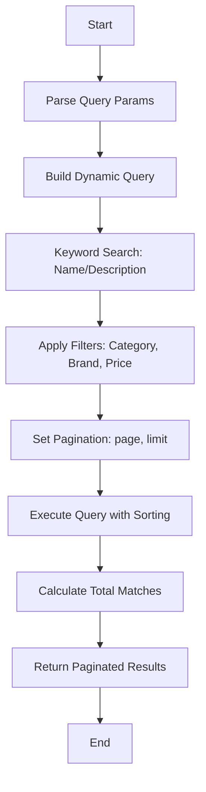
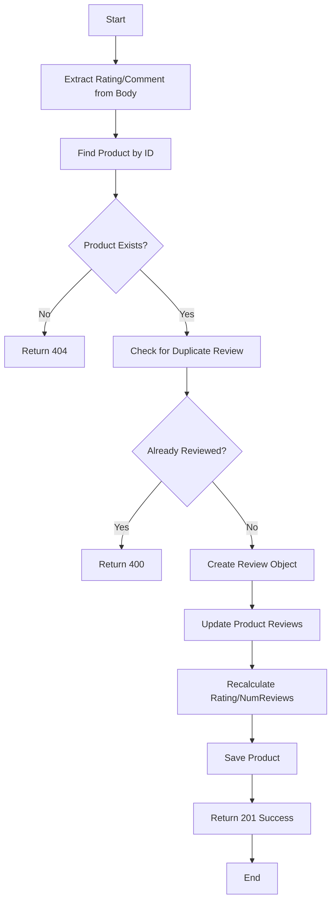
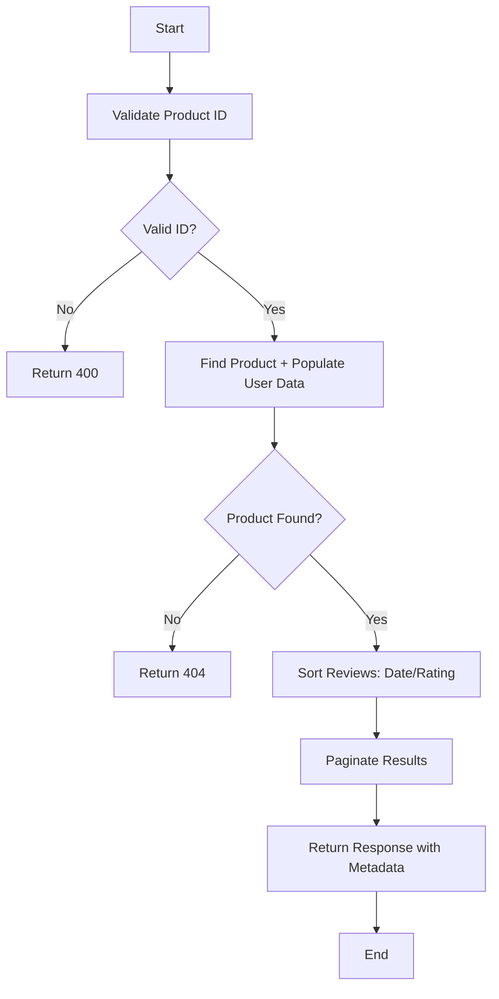
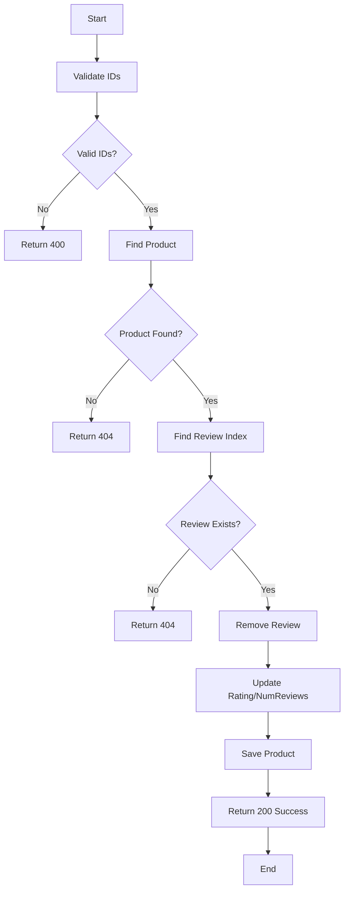

### **1. getAllProducts Workflow**

**Key Notes:**

- **Pagination:** Uses `page` and `limit` query params to split results.
- **Sorting:** Defaults to `createdAt` but can be customized via `sortBy` and `order` (asc/desc).
- **Efficiency:** Uses MongoDB's `skip`, `limit`, and `sort` for optimized queries.
- **Response:** Includes metadata like `totalItems`, `currentPage`, and `totalPages`.

---

### **2. getProductById Workflow**

**Key Notes:**

- **Validation:** Checks for valid MongoDB `ObjectId`.
- **Error Handling:** Returns `404` if product not found, `500` for server errors.
- **Response:** Returns the full product document if found.

---

### **3. searchProducts Workflow**

**Key Notes:**

- **Dynamic Query:** Combines keyword search (regex) with exact filters (category/brand).
- **Price Range:** Uses `$gte` (min) and `$lte` (max) for numeric filtering.
- **Sorting:** Applied at DB level for efficiency.
- **Pagination:** Similar to `getAllProducts` but with filter-aware totals.

---

### **4. addReview Workflow**

**Key Notes:**

- **Authentication:** Assumes user is logged in (middleware handles this).
- **Duplicate Check:** Prevents multiple reviews per user.
- **Data Update:** Recalculates `rating` and `numReviews` dynamically.
- **Response:** Returns `201 Created` on success.

---

### **5. getProductReviews Workflow**

**Key Notes:**

- **Population:** Fetches reviewer names from User collection via `populate`.
- **Sorting:** Supports `date` (newest first) or `rating` (highest first).
- **Pagination:** Uses `slice` for in-memory pagination after sorting.
- **Response:** Includes reviewer names and pagination details.

---

### **6. deleteReview Workflow**

**Key Notes:**

- **Admin-Only:** Assumes admin role is verified (middleware).
- **Cleanup:** Updates `rating` and `numReviews` after deletion.
- **Idempotent:** Returns `200` even if review was already deleted.

---

### **General Notes:**

- **Error Handling:** All controllers use `asyncHandler` to catch async errors.
- **Validation:** Joi schemas (not shown) validate input data before these workflows.
- **Security:** XSS sanitization is applied to user-generated content (e.g., reviews).
