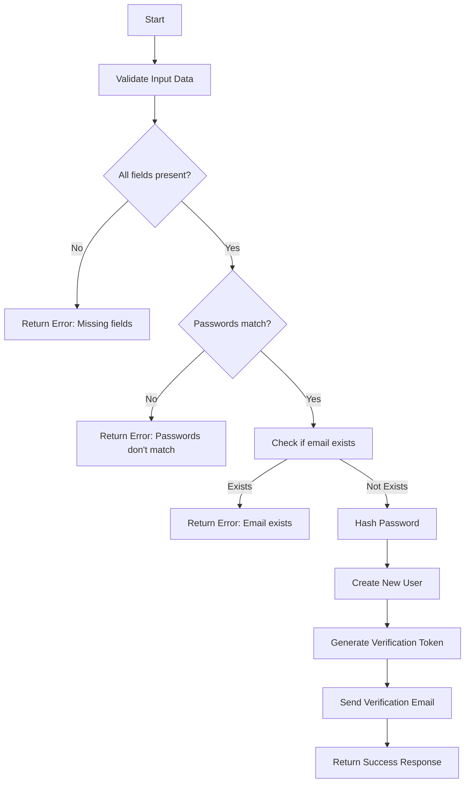
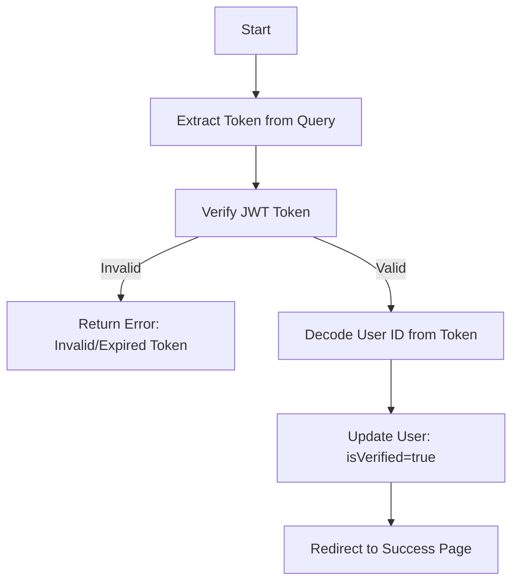
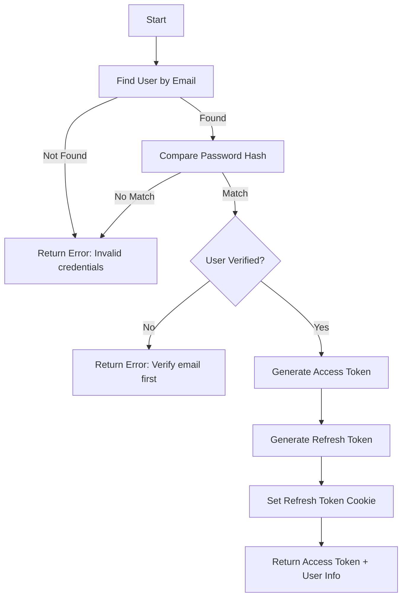
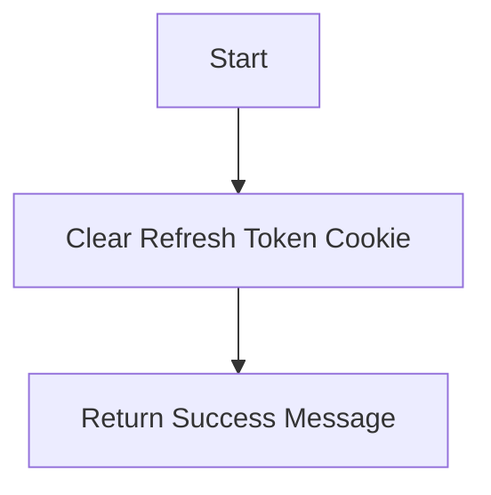
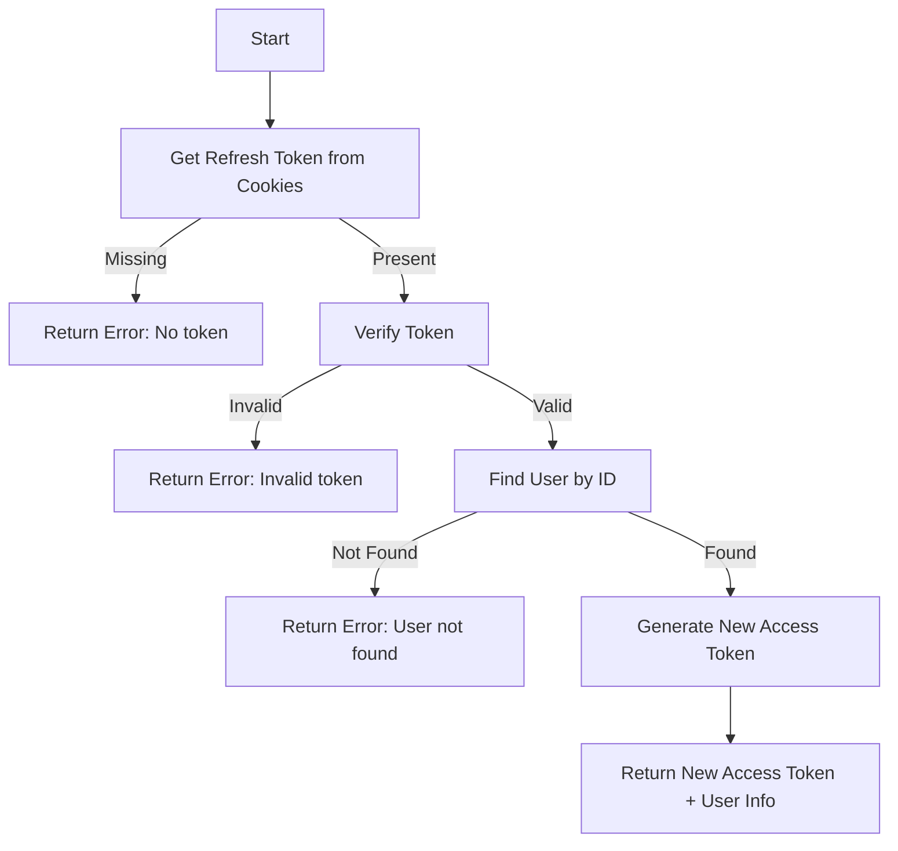
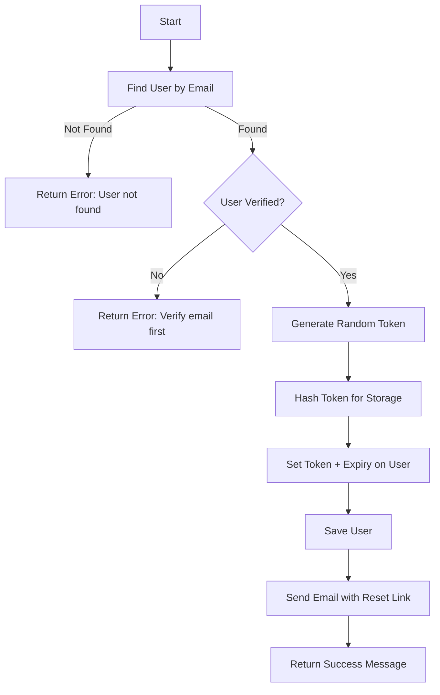
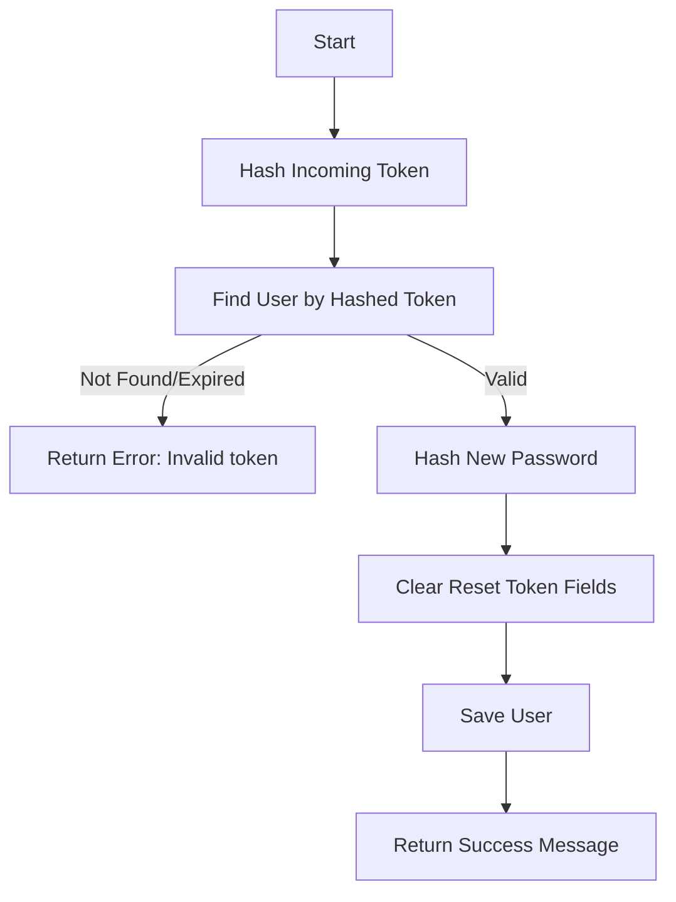

# Authentication Controller Workflows

## 1. Register User Workflow

**Key Notes:**

- Input validation ensures all required fields are present and properly formatted
- Password matching is checked before any database operations
- Email uniqueness is verified to prevent duplicate accounts
- Password is hashed with bcrypt (10 salt rounds) before storage
- Verification token is JWT signed with JWT_SECRET, expires in 1 day
- Email contains link to verification endpoint with token as query param
- User is created with isVerified=false by default

## 2. Verify Email Workflow

**Key Notes:**

- Token comes from URL query parameter
- JWT verification uses same JWT_SECRET as signing
- On success, updates user document atomically
- Redirects to frontend success page (SPA route)
- No sensitive operations performed before token validation
- Short-lived token (1 day) reduces security risks

## 3. Login User Workflow

**Key Notes:**

- Email lookup includes password field (normally excluded)
- bcrypt.compare used for secure password verification
- Email verification is mandatory before login
- Access token is short-lived (typically 15-30 minutes)
- Refresh token is long-lived (30 days) and HTTP-only
- Cookie is secure in production, strict SameSite policy
- Returns minimal necessary user data to client

## 4. Logout User Workflow

**Key Notes:**

- Cookie expiration set to past date (immediately expires)
- HTTP-only flag maintained for security
- Simple response confirms logout success
- Client should delete access token from memory
- No server-side token invalidation needed (stateless JWT)

## 5. Refresh Token Workflow

**Key Notes:**

- Only accepts refresh token from HTTP-only cookie
- Verifies against REFRESH_TOKEN_SECRET
- Generates fresh access token with same user claims
- Returns updated user data in case of changes
- Doesn't refresh the refresh token (rotation not implemented)
- Maintains session without requiring re-authentication

## 6. Forgot Password Workflow

**Key Notes:**

- Uses crypto for cryptographically secure random token
- Stores hashed version only (security best practice)
- Token expires in 1 hour (3600000 ms)
- Email contains unhashed token in reset URL
- Verification requirement prevents email enumeration
- Doesn't reveal whether email exists in error message

## 7. Reset Password Workflow

**Key Notes:**

- Hashes URL token to match database record
- Checks both token validity and expiration time
- Uses same bcrypt hashing as registration (10 rounds)
- Atomic clearing of token/expiry fields
- Secure even if attacker gains database access (hashed tokens)
- Immediate invalidation of reset link after use
