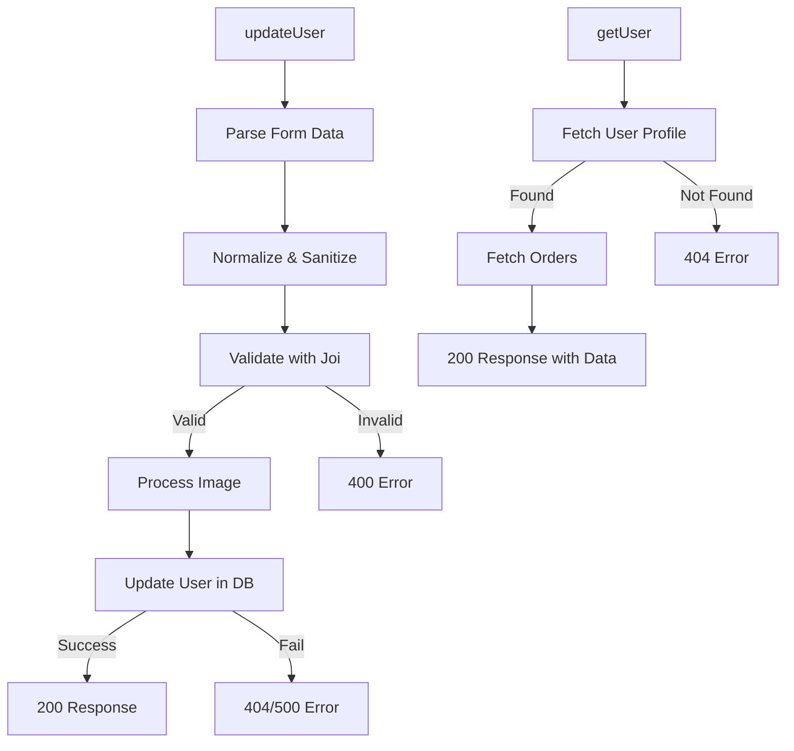

### Visual Workflow for `updateUser` Controller

#### 1. **Parse Form Data**

- **Tool**: `formidable`
  - Parses `multipart/form-data` (handles file uploads and form fields).
  - **Settings**:
    - `multiples: false`: Only one file per field.
    - `uploadDir`: Temporary directory for uploaded files.
    - `keepExtensions: true`: Preserves file extensions (e.g., `.jpg`).

#### 2. **Normalize and Sanitize Fields**

- **Normalization**:
  - Convert single-item arrays (common in `formidable`) to strings.
- **Sanitization**:
  - Use `xss` to clean strings and prevent XSS attacks.
  - Trim whitespace from all fields.

#### 3. **Validate Input**

- **Tool**: Joi schema (`updateUserSchema`).
- Checks:
  - Required fields.
  - Data types (e.g., email format).
  - Custom validation rules (e.g., password strength).
- **Error Handling**:
  - Return `400 Bad Request` with detailed error messages if validation fails.

#### 4. **Process Profile Image (if uploaded)**

- Extract file path from `files.profileImage`.
- Save path as `/uploads/{filename}` in the database.

#### 5. **Update User in Database**

- **Method**: `User.findByIdAndUpdate`.
  - `req.user._id`: Authenticated user’s ID (from JWT).
  - `{ $set: value }`: Updates only validated fields.
  - Options: `{ new: true }` (returns updated document), `runValidators: true` (re-runs schema validation).
- **Error Handling**:
  - `404 Not Found` if user doesn’t exist.
  - `500 Internal Server Error` for database issues.

#### 6. **Respond to Client**

- **Success**: `200 OK` with updated user data.
- **Failure**: Appropriate error status and message.

---

### Visual Workflow for `getUser` Controller

#### 1. **Fetch User Profile**

- **Method**: `User.findById(req.user._id)`.
  - `req.user._id`: Authenticated user’s ID (from JWT).
  - `.select("-password")`: Excludes password from the response.

#### 2. **Check User Existence**

- If user not found:
  - Return `404 Not Found` with error message.

#### 3. **Fetch User’s Orders**

- **Method**: `Order.find({ user: req.user._id })`.
  - Queries all orders linked to the user’s ID.
  - Sorts by `createdAt: -1` (newest first).

#### 4. **Respond to Client**

- **Success**: `200 OK` with combined data:
  ```json
  {
    "user": {
      /* user profile */
    },
    "orders": [
      /* array of orders */
    ]
  }
  ```

---

### Key Notes for Both Workflows

1. **Authentication**:

   - Both controllers use `req.user._id` (set by auth middleware) to ensure users only access their own data.

2. **Error Handling**:

   - Explicit checks for `404` (user not found) and `500` (server errors).
   - Validation errors (`400`) include detailed messages for debugging.

3. **Security**:

   - `xss` sanitization prevents XSS attacks.
   - Passwords are excluded from responses.

4. **File Uploads**:

   - `updateUser` handles profile images securely:
     - Files are temporarily saved, then referenced by path.
     - No direct file manipulation in the response.

5. **Data Integrity**:

   - Joi validation ensures only valid data reaches the database.
   - `runValidators: true` enforces schema rules on updates.

6. **Performance**:
   - Orders are fetched in descending order for a better UX (recent orders first).

### Visual Summary (Mermaid Diagram)


