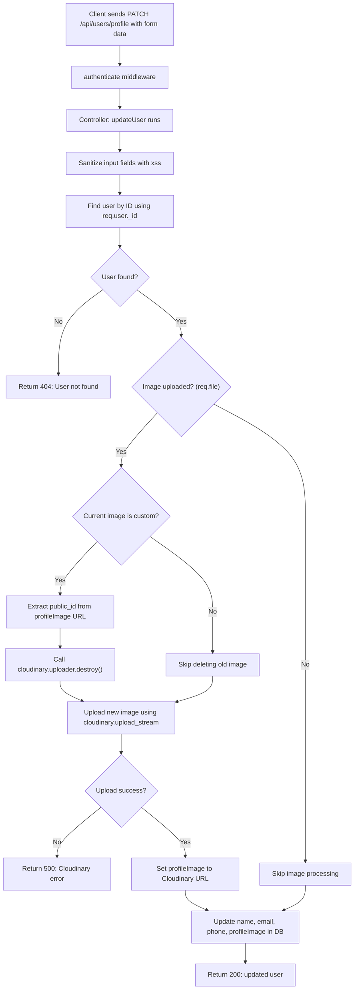
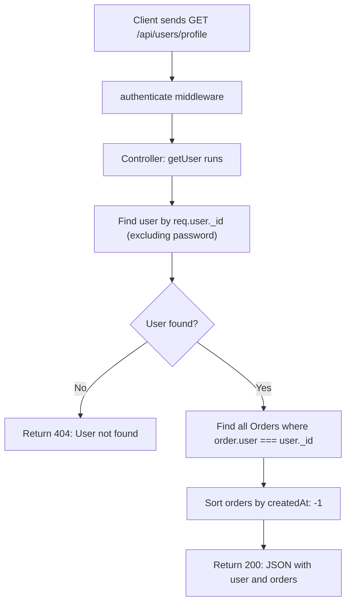

Ah! Got it — you want **separate Mermaid workflows for each controller** in text format. Here's a breakdown of **each controller as its own Mermaid flowchart**, with full logic and decision points.

---

## 🧩 1. `updateUser` Controller — `PATCH /api/users/profile`

---

## 🧩 2. `getUser` Controller — `GET /api/users/profile`

---

### 🧠 Quick Tips

- `authenticate` middleware is shared between both controllers and must extract the JWT from headers (`Authorization: Bearer <token>`).
- The update controller depends on:

  - `multer` middleware to attach `req.file`
  - `cloudinary` and `streamifier` to handle uploads

- The get controller populates order history for dashboard views or user account pages.

---

Would you like me to include these workflows in a Markdown file or export to SVG or PNG later?
