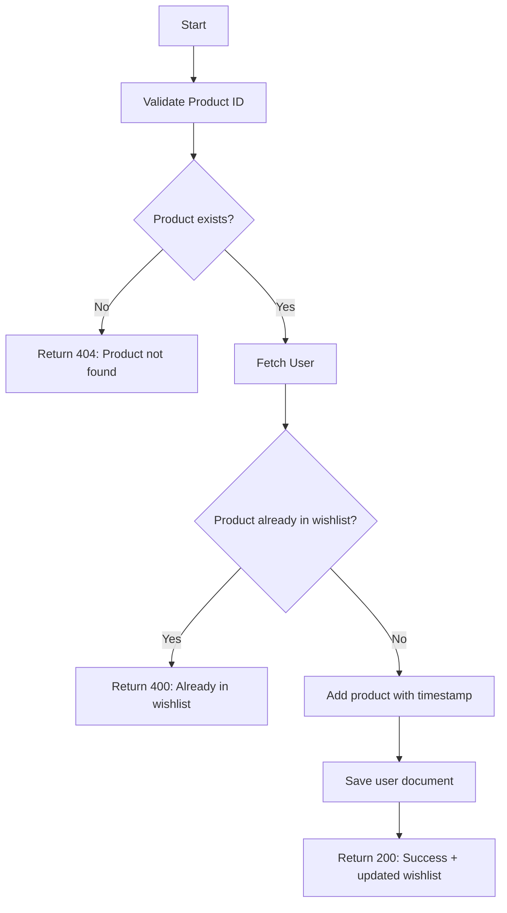
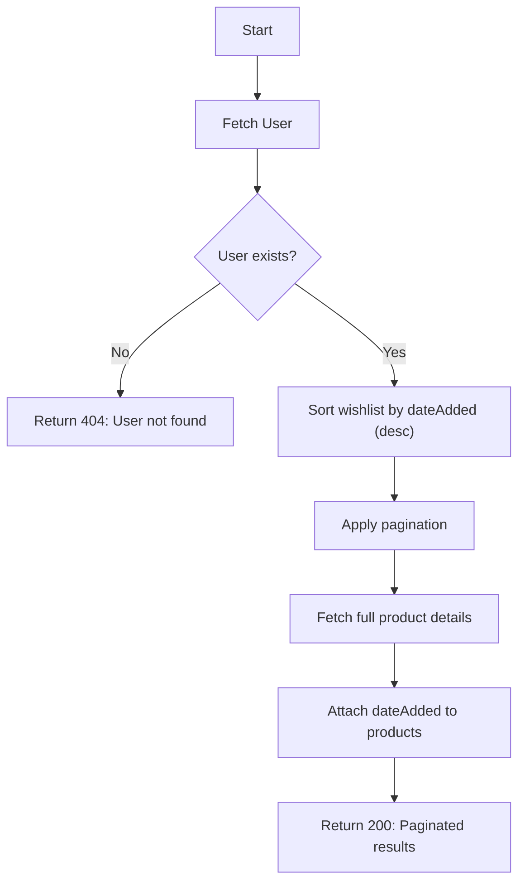
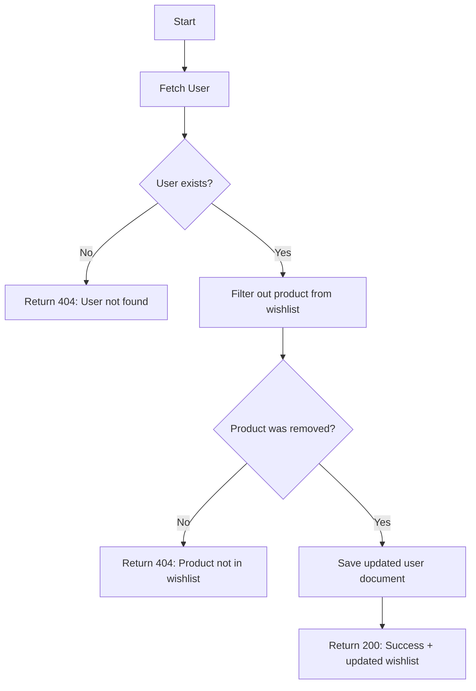

### **1. addToWishlist Workflow**

**Route:** `POST /api/wishlist/:productId`  
**Purpose:** Add a product to the user's wishlist with a timestamp.

**Key Notes:**

- **Step 1 (Product Validation):** Checks if the product exists in the database.
- **Step 2 (User Fetch):** Retrieves the authenticated user.
- **Step 3 (Duplicate Check):** Ensures no duplicates by comparing `productId`.
- **Step 4 (Timestamp):** Adds the current date (`new Date()`) to track when the item was added.
- **Error Handling:** Returns specific status codes (`404` for missing product, `400` for duplicates).

### **2. getWishlist Workflow**

**Route:** `GET /api/wishlist?page=1&limit=10`  
**Purpose:** Retrieve paginated wishlist items sorted by date (newest first).

**Key Notes:**

- **Pagination:** Uses `page` and `limit` query parameters (default: `page=1`, `limit=10`).
- **Sorting:** Sorts items by `dateAdded` (newest first) before pagination.
- **Product Population:** Fetches full product details for each wishlist item.
- **Response Structure:** Includes metadata like `totalPages` and `totalItems`.
- **Edge Cases:** Filters out `null` products (if a product was deleted but remains in the wishlist).

### **3. removeFromWishlist Workflow**

**Route:** `DELETE /api/wishlist/:productId`  
**Purpose:** Remove a product from the user's wishlist.

**Key Notes:**

- **Step 1 (User Validation):** Ensures the user exists.
- **Step 2 (Filtering):** Uses `Array.filter()` to remove the product by `productId`.
- **Change Detection:** Compares array lengths to confirm removal.
- **Error Handling:** Returns `404` if the product wasn’t in the wishlist.
- **Atomic Operation:** Saves the updated user document to the database.

### **General Notes for All Workflows**

1. **Authentication:** All routes are private (`@access Private`), requiring a valid user token.
2. **Error Handling:** Uses `asyncHandler` to catch and forward errors to Express’s error middleware.
3. **Data Integrity:**
   - Checks for existence of both user and product.
   - Uses `lean()` in `getWishlist` for performance optimization.
4. **Timestamps:** `dateAdded` ensures sorting by recency in `getWishlist`.
5. **Response Consistency:** All endpoints return the updated wishlist for client-side synchronization.
