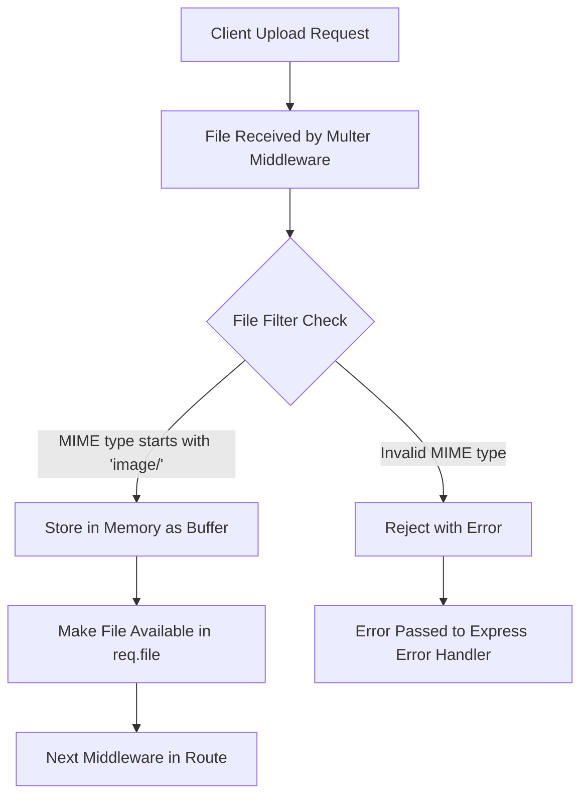

# Mermaid Workflow and Detailed Explanation for `upload.js`

## Mermaid Workflow Diagram



## Detailed Explanation of `upload.js`

### 1. Multer Initialization

- **Purpose**: The code configures multer middleware to handle file uploads in a Node.js/Express application.
- **Key Components**:
  - `multer`: A middleware for handling `multipart/form-data`, primarily used for file uploads.
  - `memoryStorage`: Stores files in memory as Buffer objects rather than writing to disk.
  - `fileFilter`: Custom function to validate uploaded files.

### 2. Storage Configuration (`memoryStorage`)

- **Behavior**:
  - When a file is uploaded, it's held in the server's RAM as a Buffer object.
  - This is temporary storage - files will be lost when the server restarts.
  - Ideal when you need to process files immediately (e.g., upload to cloud storage).
- **Advantages**:
  - No disk I/O operations
  - Faster processing for immediate file handling
  - No need to clean up temporary files
- **Disadvantages**:
  - Not suitable for large files (limited by server memory)
  - Files are lost if server crashes

### 3. File Filter Function

- **Validation Logic**:
  - Checks the file's MIME type using `file.mimetype`
  - Only accepts files where MIME type starts with `"image/"` (e.g., image/jpeg, image/png)
- **Callback Behavior**:
  - `cb(null, true)`: Accepts the file (no error, true to accept)
  - `cb(new Error(...), false)`: Rejects the file with an error message
- **Security Implications**:
  - Prevents non-image uploads that could be malicious
  - Note: MIME types can be spoofed - additional validation may be needed in production

### 4. Multer Instance Configuration

- **Combines**:
  - The memory storage configuration
  - The custom file filter
- **Result**:
  - Creates middleware functions like:
    - `upload.single('fieldname')`: For single file uploads
    - `upload.array('fieldname')`: For multiple files
    - `upload.fields([...])`: For multiple fields

### 5. Export and Usage

- **Typical Route Usage**:

  ```javascript
  const express = require("express");
  const upload = require("./upload");
  const app = express();

  app.post("/upload", upload.single("image"), (req, res) => {
    // Uploaded file is available in req.file
    if (!req.file) {
      return res.status(400).send("No file uploaded or invalid file type");
    }
    // Process the file buffer (req.file.buffer)
    res.send("File uploaded successfully");
  });

  // Error handling middleware for upload errors
  app.use((err, req, res, next) => {
    if (err instanceof multer.MulterError) {
      return res.status(400).send("File upload error: " + err.message);
    }
    res.status(500).send("Something broke!");
  });
  ```

### 6. File Object Structure (req.file)

When a file is successfully uploaded, it will have this structure:

```javascript
{
  fieldname: 'form-field-name',
  originalname: 'user-file-name.jpg',
  encoding: '7bit',
  mimetype: 'image/jpeg',
  buffer: <Buffer ff d8 ff e0 ... >, // The actual file data
  size: 12345 // File size in bytes
}
```

### 7. Error Handling

- **Multer Errors**: Special error type for upload issues (file size, etc.)
- **Custom Errors**: Like our file filter rejection
- **Important**: Always include error handling middleware after your routes

### 8. Security Considerations

1. Always validate file content (MIME type can be spoofed)
2. Consider limiting file sizes (`limits` option in multer)
3. Process files in a sandboxed environment if they'll be executed
4. Scan files for malware in production

### 9. Performance Considerations

- Memory storage is fast but consumes RAM
- For large files or high traffic, consider:
  - Streaming directly to cloud storage
  - Using disk storage with cleanup processes
  - Implementing rate limiting

This configuration provides a secure foundation for handling image uploads while giving flexibility for further processing of the uploaded files in memory.
