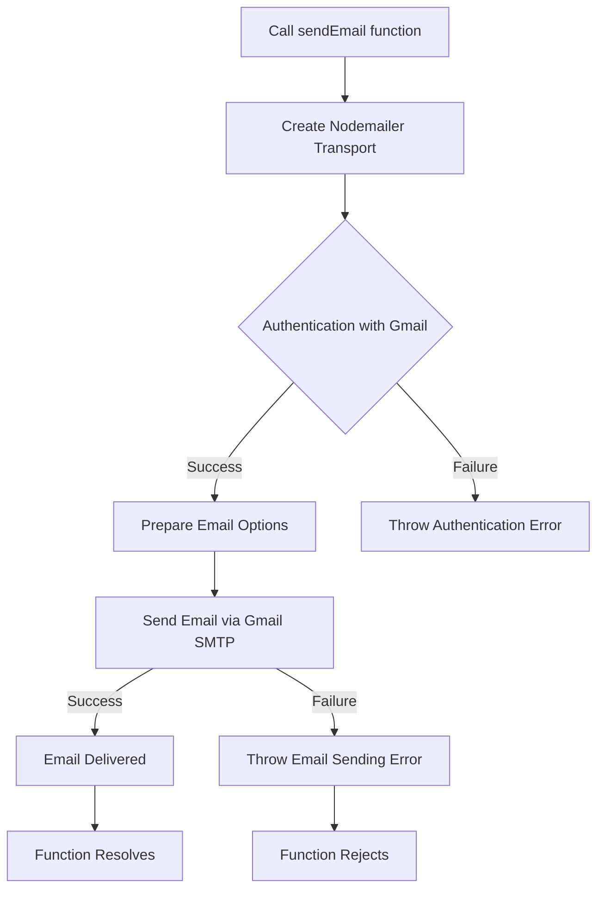

# Mermaid Workflow and Detailed Explanation for `email.js`

## Mermaid Workflow Diagram



## Detailed Explanation of `email.js`

### 1. Module Initialization

- **Purpose**: The code exports an asynchronous function to send emails using Nodemailer with a Gmail SMTP service.
- **Key Components**:
  - `nodemailer`: A Node.js module for sending emails
  - `createTransport`: Creates a reusable SMTP transporter object
  - `sendMail`: The method that actually sends the email

### 2. Transport Configuration

- **Gmail SMTP Setup**:
  ```javascript
  const transporter = nodeMailer.createTransport({
    service: "Gmail", // Uses Gmail's SMTP server
    auth: {
      user: process.env.EMAIL_USER, // From environment variables
      pass: process.env.EMAIL_PASS, // From environment variables
    },
  });
  ```
- **Security Notes**:
  - Credentials are loaded from environment variables (security best practice)
  - For production, consider:
    - Using OAuth2 instead of plain credentials
    - Setting up a dedicated email service (SendGrid, Mailgun, etc.)
    - Enabling "Less Secure Apps" in Gmail or using App Passwords

### 3. Email Sending Function (`sendEmail`)

- **Parameters**:
  - `to`: Recipient email address(es) (string or array)
  - `subject`: Email subject line
  - `html`: HTML content of the email
- **Email Options**:
  ```javascript
  {
    from: `Your Store <${process.env.EMAIL_USER}>`, // Sender identification
      to, // Recipient(s)
      subject, // Email subject
      html; // HTML email body
  }
  ```
- **Behavior**:
  - Asynchronous function (returns a Promise)
  - Throws errors if:
    - Authentication fails
    - Email sending fails
    - Invalid parameters provided

### 4. Environment Variables

- **Required Variables**:
  - `EMAIL_USER`: Your Gmail address (e.g., "yourname@gmail.com")
  - `EMAIL_PASS`: Your Gmail password or app-specific password
- **Best Practices**:
  - Never hardcode credentials in source files
  - Use a `.env` file in development
  - Use proper secret management in production

### 5. Error Handling

- **Potential Errors**:
  - Authentication errors (invalid credentials)
  - Connection errors (network issues)
  - Rate limiting (Gmail has sending limits)
  - Invalid email addresses
- **Production Recommendations**:
  - Implement retry logic for temporary failures
  - Add logging for sent/failed emails
  - Set up email queues for high-volume sending

### 6. Usage Example

```javascript
const sendEmail = require("./email");

// Basic usage
sendEmail(
  "customer@example.com",
  "Order Confirmation",
  `
  <h1>Thank you for your order!</h1>
  <p>Your order #12345 has been received.</p>
`
)
  .then(() => console.log("Email sent"))
  .catch((err) => console.error("Email failed:", err));

// Advanced usage with async/await
async function sendWelcomeEmail(user) {
  try {
    await sendEmail(
      user.email,
      "Welcome to Our Store",
      `<p>Hello ${user.name}, welcome to our store!</p>`
    );
    console.log("Welcome email sent");
  } catch (error) {
    console.error("Failed to send welcome email:", error);
  }
}
```

### 7. Gmail-Specific Considerations

- **Sending Limits**:
  - 500 emails per day (free accounts)
  - 100 recipients per message
  - 24-hour rolling limit
- **Security Recommendations**:
  - Enable 2-factor authentication
  - Create an app-specific password if using 2FA
  - Consider moving to a transactional email service for production

### 8. HTML Email Best Practices

- **Content Guidelines**:
  - Keep HTML simple and test across email clients
  - Use inline styles (many email clients strip `<style>` tags)
  - Include a plain-text alternative for better deliverability
- **Template Suggestions**:
  - Consider using a templating engine (EJS, Handlebars)
  - Create reusable template components

### 9. Production Enhancements

1. **DKIM/DMARC Setup**: Authenticate your emails to improve deliverability
2. **Email Queues**: Use Bull or similar for handling large volumes
3. **Open/Click Tracking**: Add tracking pixels and links
4. **Bounce Handling**: Process bounced emails and update your database
5. **Unsubscribe Links**: Include in all marketing emails for compliance

This implementation provides a basic but functional email sending capability that can be extended for production use cases while maintaining security best practices through environment variable configuration.
